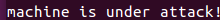

# SDN-DDos
this project is based on DDos attack detection combined with machine learning in the SDN environment,
which can detect whether the current host is attacked by DDos.  
created by: team-Neko USTB


## Preparatory work
recommended operating system:   
**ubuntu 16.04 or ubuntu 18.04** 

1. mininet:  `sudo apt install mininet`
2. pox:  `git clone https://github.com/noxrepo/pox`
3. hyping3: `sudo apt install hyping3`
4. tshark: `sudo apt install tshark`
5. tensorflow、numpy、pandas、matplotlib：`pip install tensorflow==1.14 numpy pandas matplotlib`

Also, you can use our shell script to install all above:
```
$ chmod +x preinstall.sh
$ ./preinstall.sh
```

## Demo 

1. start the POX controller:`$ ./pox.py openflow.of_01 --address=127.0.0.1 --port=8877 pox.forwarding.l2_learning` 
2. use mininet to build topology: `$ sudo mn --custom sdntopo.py --topo mytopo --controller=remote,ip=127.0.0.1,port=8877 --switch ovsk,protocols=OpenFlow10`
3. use pingall to test the connectivity：`pingall`
4. use hyping3 simulated the DDos attack：`h3 hping3 h1 -p 80 -S -i u400 --rand-source`
5. start DDos attack detection：`./detect.sh`


## Result
if 'machine is under attack' appears in the terminal, it means that a DDos attack has been successfully detected.

